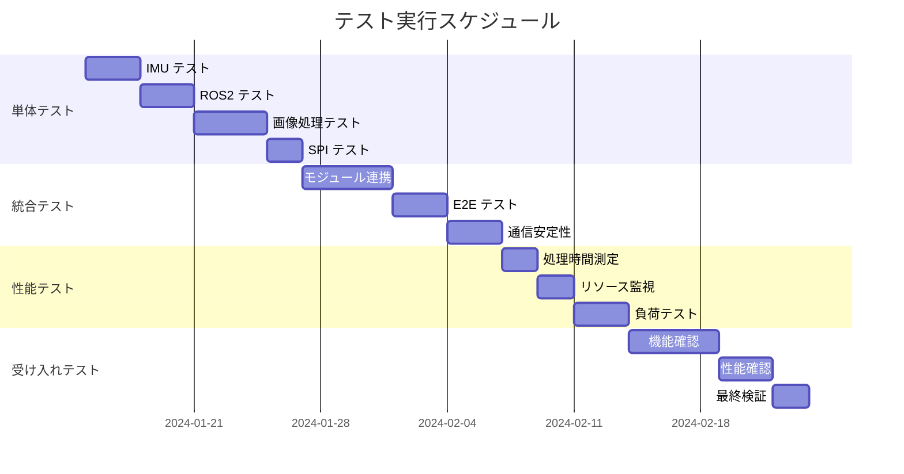

# ESP32 Isolation Sphere テスト仕様書

## 変更履歴
| バージョン | 日付 | 変更内容 | 承認者 |
|-----------|------|----------|--------|
| 1.0.0 | 2024/XX/XX | 初版作成 | - |

## 目次
1. [テスト概要](#1-テスト概要)
2. [テスト戦略](#2-テスト戦略)
3. [テスト環境](#3-テスト環境)
4. [単体テスト](#4-単体テスト)
5. [統合テスト](#5-統合テスト)
6. [性能テスト](#6-性能テスト)
7. [受け入れテスト](#7-受け入れテスト)
8. [テスト自動化](#8-テスト自動化)
9. [テストスケジュール](#9-テストスケジュール)

## 1. テスト概要

### 1.1 テスト目的
ESP32 Isolation Sphereファームウェアが要件定義書に記載された全ての機能要件・非機能要件を満たすことを検証する。

### 1.2 テスト対象システム
- **ハードウェア**: ESP32S3R + BNO055 + Round Display
- **ソフトウェア**: ESP-IDF v5.1.2+ベースファームウェア
- **通信**: ROS2 Humble, WiFi, SPI, I2C
- **外部システム**: Raspberry Pi (ROS2 Agent), RP2350

### 1.3 テスト品質目標
| 品質特性 | 目標値 | 測定方法 |
|---------|--------|----------|
| 機能網羅性 | 100% | 要件追跡マトリックス |
| コードカバレッジ | 80%以上 | gcov + lcov |
| 分岐カバレッジ | 70%以上 | 静的解析 |
| 欠陥密度 | 5個/KLOC未満 | 欠陥管理システム |
| 性能達成率 | 95%以上 | パフォーマンステスト |

## 2. テスト戦略

### 2.1 テストピラミッド構成

```
        受け入れテスト (E2E)
       ┌─────────────────────┐
      │    System Testing    │ 10%
     └─────────────────────┘
    ┌─────────────────────────┐
   │   Integration Testing   │ 30%
  └─────────────────────────┘
 ┌─────────────────────────────┐
│      Unit Testing           │ 60%
└─────────────────────────────┘
```

### 2.2 テスト観点マトリックス

| 機能モジュール | 単体 | 統合 | 性能 | 受入 | 優先度 |
|---------------|------|------|------|------|--------|
| IMU制御 | ✓ | ✓ | ✓ | ✓ | High |
| ROS2通信 | ✓ | ✓ | ✓ | ✓ | High |
| 画像処理 | ✓ | ✓ | ✓ | ✓ | High |
| SPI転送 | ✓ | ✓ | ✓ | ✓ | High |
| 表示制御 | ✓ | ✓ | - | ✓ | Medium |
| 設定管理 | ✓ | - | - | ✓ | Low |

### 2.3 テスト手法選定

| テスト種別 | 手法 | ツール | 実行頻度 |
|-----------|------|--------|----------|
| 単体テスト | TDD/BDD | Unity + CMock | 毎コミット |
| 統合テスト | Black Box | pytest + Robot | 毎日 |
| 性能テスト | 負荷・ストレス | ESP32 Profiler | 毎週 |
| 受け入れテスト | UAT | 手動 + 自動 | 毎スプリント |

## 3. テスト環境

### 3.1 ハードウェアテスト環境

#### 3.1.1 Unit Test環境
- **ESP32エミュレータ**: QEMU ESP32
- **仮想IMU**: BNO055シミュレータ
- **モックSPI**: ESP-IDF SPI Mock Driver

#### 3.1.2 Integration Test環境
- **実機**: ESP32S3R開発ボード
- **センサー**: BNO055搭載ブレークアウト
- **ディスプレイ**: GC9A01 Round LCD
- **通信**: USB-UART Bridge

#### 3.1.3 Performance Test環境
- **測定器**: Logic Analyzer (24ch)
- **電源**: 可変電源 + 電流計
- **環境**: 電波暗室（WiFi性能測定用）

### 3.2 ソフトウェアテスト環境

#### 3.2.1 開発環境
```bash
# テスト環境セットアップ
./setup_test_env.sh
source test_venv/bin/activate
pip install -r test_requirements.txt
```

#### 3.2.2 CI/CD環境
- **GitHub Actions**: Ubuntu 22.04 Runner
- **Docker**: esp-idf:latest container
- **Artifacts**: テスト結果レポート自動生成

## 4. 単体テスト

### 4.1 IMUモジュールテスト

#### 4.1.1 BNO055ドライバテスト
| Test ID | テスト項目 | 入力 | 期待出力 | 優先度 |
|---------|-----------|------|----------|--------|
| UT_IMU_001 | I2C通信初期化 | 正常パラメータ | ESP_OK | High |
| UT_IMU_002 | I2C通信初期化失敗 | 異常パラメータ | ESP_FAIL | High |
| UT_IMU_003 | Quaternion読み取り | - | 正規化済みQuaternion | High |
| UT_IMU_004 | キャリブレーション状態取得 | - | 0-3の値 | Medium |
| UT_IMU_005 | I2C通信タイムアウト | 無応答センサー | ESP_ERR_TIMEOUT | High |

#### 4.1.2 姿勢データ処理テスト
| Test ID | テスト項目 | 入力 | 期待出力 | 優先度 |
|---------|-----------|------|----------|--------|
| UT_POSE_001 | Quaternion正規化 | (1,1,1,1) | (0.5,0.5,0.5,0.5) | High |
| UT_POSE_002 | SLERP補間 | q1,q2,t=0.5 | 中間回転 | High |
| UT_POSE_003 | 異常値検出 | NaN含むQuaternion | フィルタリング | High |
| UT_POSE_004 | 座標系変換 | センサー座標 | ワールド座標 | Medium |
| UT_POSE_005 | オフセット補正 | 基準姿勢 | 補正後姿勢 | Medium |

### 4.2 ROS2通信モジュールテスト

#### 4.2.1 micro-ROS通信テスト
| Test ID | テスト項目 | 入力 | 期待出力 | 優先度 |
|---------|-----------|------|----------|--------|
| UT_ROS_001 | Agent接続 | 正常ネットワーク | 接続成功 | High |
| UT_ROS_002 | Agent接続失敗 | 無効IP | 接続失敗 | High |
| UT_ROS_003 | Topic購読 | video/frame | コールバック実行 | High |
| UT_ROS_004 | Topic発行 | IMU Quaternion | 送信成功 | High |
| UT_ROS_005 | QoS設定 | Best Effort | QoS適用確認 | Medium |

#### 4.2.2 ダブルバッファリングテスト
| Test ID | テスト項目 | 入力 | 期待出力 | 優先度 |
|---------|-----------|------|----------|--------|
| UT_BUF_001 | バッファ初期化 | 2つのバッファ | 初期状態設定 | High |
| UT_BUF_002 | バッファ切り替え | フレーム完了 | インデックス更新 | High |
| UT_BUF_003 | 排他制御 | 同時アクセス | データ整合性 | High |
| UT_BUF_004 | オーバーフロー | 処理遅延 | 古いフレーム破棄 | Medium |

### 4.3 画像処理モジュールテスト

#### 4.3.1 JPEG展開テスト
| Test ID | テスト項目 | 入力 | 期待出力 | 優先度 |
|---------|-----------|------|----------|--------|
| UT_JPEG_001 | 正常JPEG展開 | 320x160 JPEG | RGB配列 | High |
| UT_JPEG_002 | 不正JPEGデータ | 破損データ | エラー検出 | High |
| UT_JPEG_003 | サイズ不一致 | 640x480 JPEG | エラー/リサイズ | Medium |
| UT_JPEG_004 | メモリ不足 | 大容量JPEG | エラーハンドリング | High |
| UT_JPEG_005 | 処理時間測定 | 標準画像 | 5ms以内 | High |

#### 4.3.2 球面マッピングテスト
| Test ID | テスト項目 | 入力 | 期待出力 | 優先度 |
|---------|-----------|------|----------|--------|
| UT_SPHERE_001 | 座標変換 | (u,v) → (θ,φ) | 正確な変換 | High |
| UT_SPHERE_002 | 補間処理 | 中間点 | バイリニア補間 | High |
| UT_SPHERE_003 | 境界処理 | エッジピクセル | 適切な処理 | Medium |
| UT_SPHERE_004 | LUT生成 | LED座標リスト | マッピングテーブル | High |
| UT_SPHERE_005 | 回転変換 | Quaternion適用 | 回転後座標 | High |

### 4.4 SPI転送モジュールテスト

#### 4.4.1 SPI通信テスト
| Test ID | テスト項目 | 入力 | 期待出力 | 優先度 |
|---------|-----------|------|----------|--------|
| UT_SPI_001 | SPI初期化 | 40MHz設定 | 初期化成功 | High |
| UT_SPI_002 | DMA転送 | 608バイト | 転送完了 | High |
| UT_SPI_003 | CRC計算 | データ+CRC | CRC一致 | High |
| UT_SPI_004 | フレーム同期 | VSYNC信号 | 同期転送 | High |
| UT_SPI_005 | エラー処理 | 通信エラー | リトライ処理 | Medium |

## 5. 統合テスト

### 5.1 モジュール間連携テスト

#### 5.1.1 IMU → 画像処理連携
| Test ID | テスト項目 | 検証内容 | 成功基準 |
|---------|-----------|----------|----------|
| IT_LINK_001 | 姿勢データ連携 | IMU→画像処理 | 遅延10ms以内 |
| IT_LINK_002 | フィルタ効果 | 姿勢変化平滑化 | ジッタ減少確認 |
| IT_LINK_003 | エラー伝播 | IMU異常時動作 | 適切なフォールバック |

#### 5.1.2 ROS2 → 画像処理連携
| Test ID | テスト項目 | 検証内容 | 成功基準 |
|---------|-----------|----------|----------|
| IT_LINK_004 | 画像受信処理 | ROS2→JPEG展開 | 30fps維持 |
| IT_LINK_005 | ダブルバッファ | 受信と処理の並行 | データ競合なし |
| IT_LINK_006 | 通信断絶時 | フェイルセーフ動作 | デモモード切替 |

### 5.2 エンドツーエンドテスト

#### 5.2.1 全体処理フロー
| Test ID | テスト項目 | 検証内容 | 成功基準 |
|---------|-----------|----------|----------|
| IT_E2E_001 | 完全処理チェーン | 画像受信→LED出力 | 33ms以内 |
| IT_E2E_002 | 30fps連続動作 | 1分間連続処理 | フレーム欠落なし |
| IT_E2E_003 | 姿勢追従精度 | IMU→表示回転 | ±1度以内 |

### 5.3 通信統合テスト

#### 5.3.1 ROS2通信安定性
| Test ID | テスト項目 | 検証内容 | 成功基準 |
|---------|-----------|----------|----------|
| IT_COMM_001 | 長時間通信 | 24時間連続 | パケットロス1%未満 |
| IT_COMM_002 | 電波環境変動 | RSSI変化時 | 自動再接続 |
| IT_COMM_003 | 複数クライアント | Agent負荷試験 | 性能劣化なし |

## 6. 性能テスト

### 6.1 処理時間性能テスト

#### 6.1.1 個別処理性能
| Test ID | 測定項目 | 目標値 | 許容値 | 測定方法 |
|---------|----------|--------|--------|----------|
| PT_TIME_001 | IMU読み取り | 1ms | 2ms | esp_timer_get_time() |
| PT_TIME_002 | JPEG展開 | 5ms | 8ms | HW割込みタイマー |
| PT_TIME_003 | 球面マッピング | 10ms | 15ms | 処理前後タイムスタンプ |
| PT_TIME_004 | SPI転送 | 2ms | 3ms | DMA完了割込み |
| PT_TIME_005 | 総処理時間 | 25ms | 33ms | フレーム周期測定 |

#### 6.1.2 リアルタイム性能
| Test ID | 測定項目 | 目標値 | 許容値 | 測定方法 |
|---------|----------|--------|--------|----------|
| PT_RT_001 | フレームレート | 30.0fps | 29.0fps | GPIO出力頻度測定 |
| PT_RT_002 | ジッタ | ±100μs | ±500μs | オシロスコープ |
| PT_RT_003 | 応答遅延 | 50ms | 80ms | 入力→出力測定 |

### 6.2 リソース使用率テスト

#### 6.2.1 CPU使用率
| Test ID | 測定項目 | 目標値 | 許容値 | 測定方法 |
|---------|----------|--------|--------|----------|
| PT_CPU_001 | Core 0平均 | 60% | 75% | FreeRTOS統計 |
| PT_CPU_002 | Core 0ピーク | 80% | 85% | 連続監視 |
| PT_CPU_003 | Core 1平均 | 70% | 80% | FreeRTOS統計 |
| PT_CPU_004 | Core 1ピーク | 85% | 90% | 連続監視 |

#### 6.2.2 メモリ使用率
| Test ID | 測定項目 | 目標値 | 許容値 | 測定方法 |
|---------|----------|--------|--------|----------|
| PT_MEM_001 | 内部RAM | 200KB | 250KB | esp_get_free_heap_size() |
| PT_MEM_002 | PSRAM | 6MB | 7MB | esp_psram_get_free_size() |
| PT_MEM_003 | フラッシュ | 3MB | 3.5MB | パーティション使用量 |
| PT_MEM_004 | メモリリーク | 0KB/h | 1KB/h | 長時間監視 |

### 6.3 負荷・ストレステスト

#### 6.3.1 高負荷テスト
| Test ID | テスト内容 | 負荷条件 | 成功基準 |
|---------|-----------|----------|----------|
| PT_LOAD_001 | CPU負荷 | 95%使用率 | 1分間安定動作 |
| PT_LOAD_002 | メモリ負荷 | 残り10%まで使用 | メモリリークなし |
| PT_LOAD_003 | 通信負荷 | 10Mbps連続送受信 | パケット欠落なし |

#### 6.3.2 温度ストレステスト
| Test ID | テスト内容 | 環境条件 | 成功基準 |
|---------|-----------|----------|----------|
| PT_TEMP_001 | 高温動作 | 60℃環境 | 機能維持 |
| PT_TEMP_002 | 低温動作 | -10℃環境 | 機能維持 |
| PT_TEMP_003 | 温度変化 | -10℃→60℃変化 | 安定動作 |

## 7. 受け入れテスト

### 7.1 機能受け入れテスト

#### 7.1.1 基本機能確認
| Test ID | テスト項目 | 操作手順 | 期待結果 |
|---------|-----------|----------|----------|
| AT_FUNC_001 | システム起動 | 電源ON | 5秒以内に動作開始 |
| AT_FUNC_002 | WiFi接続 | SSID/PWD設定 | 自動接続成功 |
| AT_FUNC_003 | 動画再生 | ROS2経由で動画送信 | 球体に映像表示 |
| AT_FUNC_004 | 姿勢追従 | デバイス回転 | 映像固定表示 |
| AT_FUNC_005 | UI操作 | 明るさ調整 | LEDの明度変更 |

#### 7.1.2 異常系動作確認
| Test ID | テスト項目 | 異常条件 | 期待結果 |
|---------|-----------|----------|----------|
| AT_ERR_001 | 通信断絶 | WiFi切断 | デモモード移行 |
| AT_ERR_002 | IMU異常 | センサー切断 | 固定表示維持 |
| AT_ERR_003 | 電源異常 | 電圧低下 | 安全停止 |
| AT_ERR_004 | 過負荷 | CPU100% | 処理優先制御 |

### 7.2 性能受け入れテスト

#### 7.2.1 ユーザー体験品質
| Test ID | 評価項目 | 測定方法 | 合格基準 |
|---------|----------|----------|----------|
| AT_UX_001 | 映像滑らかさ | 目視確認 | ちらつきなし |
| AT_UX_002 | 姿勢追従性 | 回転テスト | 遅延感なし |
| AT_UX_003 | 色再現性 | 標準画像表示 | 色差ΔE<5 |
| AT_UX_004 | 明度均一性 | 白画面表示 | 輝度差20%以内 |

#### 7.2.2 運用品質
| Test ID | 評価項目 | 測定条件 | 合格基準 |
|---------|----------|----------|----------|
| AT_OPS_001 | 連続動作 | 24時間動作 | 異常なし |
| AT_OPS_002 | 発熱 | 1時間動作後 | 60℃以下 |
| AT_OPS_003 | 電力消費 | 通常動作時 | 500mA以下 |
| AT_OPS_004 | 起動時間 | 電源ON→動作 | 10秒以内 |

## 8. テスト自動化

### 8.1 自動化範囲

| テスト種別 | 自動化率 | 自動化ツール | 実行タイミング |
|-----------|----------|-------------|---------------|
| 単体テスト | 100% | Unity + CMake | 毎コミット |
| 統合テスト | 70% | pytest + Robot | 毎日 |
| 性能テスト | 80% | カスタムスクリプト | 毎週 |
| 受け入れテスト | 30% | 手動+自動組合せ | 毎スプリント |

### 8.2 CI/CDパイプライン

#### 8.2.1 GitHub Actions ワークフロー
```yaml
name: ESP32 Test Pipeline
on: [push, pull_request]
jobs:
  unit-test:
    runs-on: ubuntu-22.04
    steps:
      - uses: actions/checkout@v3
      - name: Setup ESP-IDF
        uses: espressif/esp-idf-ci-action@v1
      - name: Run Unit Tests
        run: |
          cd test/unit
          idf.py build
          idf.py test
      - name: Generate Coverage
        run: |
          gcov --coverage
          lcov --capture --output-file coverage.info
      - name: Upload Coverage
        uses: codecov/codecov-action@v3
```

#### 8.2.2 自動テスト環境
- **ハードウェア**: Raspberry Pi 4 (テストハーネス)
- **接続**: ESP32 x 4台同時テスト
- **監視**: Grafana + InfluxDB (性能データ蓄積)

### 8.3 テストデータ管理

#### 8.3.1 テスト画像セット
- **基本画像**: チェッカーボード、グラデーション
- **動画**: 320x160, 10fps, JPEG圧縮
- **異常画像**: 破損データ、サイズ不一致
- **サイズ**: 合計100MB、Git LFS管理

#### 8.3.2 期待結果データベース
- **SQLite**: テスト結果履歴管理
- **バージョン管理**: 期待値の変更追跡
- **回帰検証**: 過去結果との自動比較

## 9. テストスケジュール

### 9.1 フェーズ別テスト実行計画



### 9.2 テスト成果物と納期

| テスト段階 | 成果物 | 納期 |
|-----------|--------|------|
| 単体テスト | ユニットテスト結果レポート | Phase 2終了時 |
| 統合テスト | 統合テスト結果レポート | Phase 3終了時 |
| 性能テスト | 性能測定結果レポート | Phase 4中間 |
| 受け入れテスト | 受け入れテスト結果レポート | Phase 4終了時 |
| 最終 | 総合テスト報告書 | プロジェクト完了時 |

### 9.3 品質メトリクス管理

#### 9.3.1 週次レポート項目
- テスト実行数/合格数
- コードカバレッジ推移
- 欠陥検出・修正状況
- 性能メトリクス推移

#### 9.3.2 品質ゲート基準
- 単体テスト: 合格率100%、カバレッジ80%以上
- 統合テスト: 合格率95%以上
- 性能テスト: SLA達成率95%以上
- 受け入れテスト: 重要機能100%合格

---
**作成日**: 2024年
**バージョン**: 1.0.0
**承認者**: [署名欄]